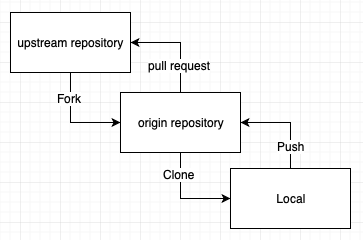

# GIT 및 Github 기초 사용법 정리

등록 2024.6.13   수정 2024.6.17

---

## 1. 개요

Git

- 파일의 수정 사항을 저장하고 관리하는 버전 컨트롤 시스템 (VCS, Virsion Control System)

Github

- Git으로 관리하는 파일을 업로드하거나 다운로드 할 수 있는 웹 인터페이스.
- 본인의 작업물을 공유하거나, 여러 사람과 협업 하는 등 용도로 쓰인다.

## 2. 사전지식

1. commit: 파일을 추가하거나 변경 내용을 저장소에 저장하는 작업.
2. push: 커밋 내용을 원격 저장소(깃허브 레포지터리)에 업로드.
3. pull: 원격 저장소의 파일을 내 로컬 저장소에 저장.
4. branch: 하나의 로컬 저장소 혹은 원격 저장소에서 나누어 놓은 여러 개별 작업 공간. 각각의 브랜치는 다른 브랜치에 영향을 주지 않는다.
5. merge: 다른 브랜치의 내용을 하나의 브랜치에 병합하는 과정. 주로 master라는 이름의 브랜치에 병합한다. push는 로컬 커밋 내용을 원격 레포지터리에 업로드하며 기존 원격 레포지터리 파일과 병합하는 과정이고, pull은 원격 레포지터리 파일을 로컬 저장소에 다운로드하며 기존 로컬 저장소 파일과 병합하는 과정이다.

<aside>
💡 **브랜치(Branch)**

브랜치는 로컬저장소(본인 컴퓨터 Git)와 원격저장소(Github 레포지터리)에서 **각각 존재**한다. 다시 말해, **본인 컴퓨터 Git에서 생성한 branch와 Github에 생성된 branch는 별개**이다.

깃허브를 사용하다 보면 터미널에 **HEAD**라는 표현이 자주 나타나는 것을 볼 수 있는데 이는 **특정 브랜치의 가장 최신 커밋을 가리키는 포인터**이다. 모든 브랜치는 HEAD를 가지고 있다.

디폴트 브랜치 이름은 일반적으로 master이지만 최근 이 표현이 과거 노예제도를 연상시킨다는 이슈가 있어 main으로 바꾸는 추세이다. 디폴트 브랜치 이름은 깃허브에서 변경 가능하다.

</aside>

## 3. Git 및 Github 사용 준비

### 1) 깃허브 계정 생성

[https://github.com/](https://github.com/)

### 2) 깃 설치

[https://git-scm.com/](https://git-scm.com/) 

### 3) 깃 초기 설정

- 사용자 등록

```powershell
git config --global user.name "[사용자 이름]" 
git config --global user.email [사용자 메일]
```

- 설정 정보 확인

```powershell
git config --list 
```

## 4. 기본적인 push, pull 하는 법

### 1) 깃허브 레포지터리 생성

깃허브 홈페이지 repository 탭에서 만들 수 있다.

### 2) 로컬 저장소에 깃 저장소 생성 및 원격 저장소 연결

- 깃 저장소 생성(깃 초기화)

해당 로컬 저장소(디렉토리)로 이동 후 아래 명령어를 입력

```powershell
git init
```

- 원격 저장소 연결(remote)

```powershell
git remote add origin [깃허브 레포지터리 URL]
```

### 3) Push

- 스테이지(버전 관리할 파일을 추가하는 작업)

```powershell
git add [파일명]
```

파일명에는 *과 같은 정규표현식 사용이 가능하다.

- 커밋

```powershell
git commit -m "[커밋 메세지 입력]" 
```

- 현재 깃 커밋, 스테이지 상태 확인

```powershell
git status
```

- 푸시(push)

```powershell
git push origin master 
```

이후, 깃허브에 접속하면 해당 파일이 master 브랜치에 업로드 되어있는 것을 확인할 수 있다. 

### 4) Pull

```powershell
git pull origin master 
```

이후, 로컬 저장소를 확인해 보면 원격 저장소의 파일이 다운로드 되어있는 것을 확인할 수 있다.

## 5. 여러 브랜치를 만들고 협업하기

### 1) 협업할 때 사용할 깃허브 레포지터리 만들기

깃허브에서 협업하기 위한 레포지터리들을 모아 놓는 조직(Organization)을 만들 수도 있다. 또한 조직과 레포지터리에서 각 사용자의 권한설정 및 외부 공개 여부도 설정 가능하다.

### 2) 공동 작업자 추가

깃허브에서 팀원의 깃허브 이메일 주소를 활용해 등록할 수 있다. 발송된 이메일을 각 팀원이 확인하고 수락을 누르면 추가되는 방식.

### 3) 공동 작업자의 PC 로컬 저장소에 원격 저장소 연결(clone)

공동 작업자 스스로 작업물을 저장할 로컬 저장소 경로로 이동하여 아래 명령어를 입력한다.

```powershell
git clone [레포지터리 URL]
```

<aside>
💡 **remote와 clone의 차이**

**git remote add** 명령어는 **원격 저장소를 로컬 깃 프로젝트에 추가**하는 것을 의미한다. 이 명령을 사용함으로써 로컬 깃 프로젝트와 원격 저장소 간의 연결이 설정된다. 즉, 로컬에서 작업한 변경사항을 원격 저장소로 업로드하거나, 원격 저장소에서 최신 변경사항을 로컬로 내려받을 때 사용된다. 따라서 이 명령어를 사용하려면 이미 로컬 저장소에 git이 생성되어 있어야 한다.

반면에, **git clone** 명령어는 **원격 저장소의 전체 내용을 복제하여 로컬에 새로운 깃 프로젝트를 생성하는 것**을 의미한다. 이 명령을 사용하면 원격 저장소의 모든 파일과 커밋 히스토리 등을 로컬로 가져올 수 있다.

결론적으로, **레포지터리 관리자는 깃 프로젝트를 만들어 레포지터리에 remote하고, 공동 작업자는 관리자가 만든 레포지터리를 clone하여 협업한다.**

</aside>

### 4) 공동 작업자 브랜치 생성하기

- 브랜치 생성

```powershell
git branch [브랜치 이름]
```

- 해당 브랜치로 이동

```powershell
git checkout [브랜치 이름]
```

- 브랜치 생성과 동시에 해당 브랜치로 이동하는 명령어

```powershell
git checkout -b [브랜치 이름]
```

- 로컬 브랜치를 원격 브랜치에 푸시하기

```powershell
git push origin [브랜치 이름]
```

### 5) 브랜치 확인 및 삭제 명령어

- 로컬 브랜치 확인

```powershell
git branch
```

- 원격 브랜치 확인

```powershell
git branch -r
```

- 모든 브랜치 확인

```powershell
git branch -a
```

브랜치 확인 명령어 입력시 앞에 *이 붙어 있는 것은 현재 브랜치라는 뜻이다.

- 로컬 브랜치 삭제

다른 브랜치로 체크아웃 후 아래 명령어를 입력

```powershell
git branch -d [브랜치 이름]
```

- 로컬 브랜치 강제 삭제

해당 로컬 브랜치에 완료되지 않은 작업이 남아있어 삭제가 되지 않는 경우 사용한다. 

역시 다른 브랜치로 체크아웃 후 아래 명령어를 입력한다.

```powershell
git branch -D [브랜치 이름]
```

### 6) 브랜치에 push 하기

<aside>
💡 **협업 시 주의 사항!**

공동 작업하는 과정에서 브랜치의 파일 내용이 변경되었을 수 있으니, 파일 수정 작업 및 push 하기 전 **항상 pull을 먼저 해야 한다.**

</aside>

- 해당 브랜치로 체크아웃

(생략)

- 스테이징

(생략)

- 커밋

(생략)

- 푸시

```powershell
 git push origin [브랜치 이름]
```

위와 같이 로컬 브랜치를 생성하고 원격 레포지터리에 푸시하면 해당 로컬 브랜치가 자동으로 원격 브랜치로 추가된다.

이후 깃허브에서 해당 브랜치가 생성되고 그 브랜치에 파일이 업로드 된 것을 확인할 수 있다.

## 6. 병합하기

### 1) 로컬 브랜치에 병합하기

- 병합하고자 하는 브랜치로 체크아웃(디폴트 브랜치, 주로 master)

(생략)

- 브랜치 병합

```powershell
git merge [병합되는 브랜치 이름] 
```

이후 로컬 디폴트 브랜치(master)에 해당 브랜치 내용이 병합된다.

### 2) 원격 저장소(깃허브 레포지터리)에 병합하기

로컬 브랜치에서 병합하는 것 보단 깃허브 레포지터리의 디폴트 브랜치에 병합하는 작업을 더 많이 수행한다.

깃허브는 **pull request(PR)**라고 하여, 개별 브랜치 내용을 디폴트 브랜치에 병합하는 요청을 보내는 기능이 있다. 아래는 pull request를 활용하여 깃허브에서 병합하는 방법을 기술한 내용이다.

- 공동 작업자가 자신의 브랜치에 결과물을 push

(생략)

- 공동 작업자가 깃허브 웹에서 **compare & pull request**를 클릭
- 공동 작업자가 메세지를 입력 후 **create pull request**를 클릭해 요청 생성
- 관리자는 확인 후 **merge pull request**를 클릭해 병합

이후 디폴트 브랜치에 공동 작업자의 브랜치 내용이 병합된 것을 확인할 수 있다.

## 7. 병합 충돌 해결하기

<aside>
💡 **병합 충돌(merge conflicts)**

merge시 **변경 내용을 자동으로 병합해주지 못해 발생하는 오류**를 병합충돌(merge conflicts)라고 한다. 

병합 충돌은 병합이 이루어지는 모든 작업에서 발생할 수 있다. 즉, pull, push, merge, pull request를 진행할 때 발생할 수 있다.

</aside>

병합 충돌은 로컬에서 해결 후 다시 커밋할 수도 있지만, 깃허브에서는 pull request시 발생한 병합충돌을 해결하는 인터페이스를 제공해 주는데 이를 활용하는 것이 더 편리하다.

### 1) 로컬에서 병합 충돌 해결하고 다시 커밋하기

- 병합 충돌이 발생하면 터미널에서 아래와 같은 에러 메세지가 출력된다.

```powershell
CONFLICT (content): Merge conflict in [병합 충돌이 발생한 파일 이름]
Automatic merge failed; fix conflicts and then commit the result.
```

- 병합 충돌이 발생한 파일을 열어보면 아래와 같은 기호가 표시된다.

```powershell
If you have questions, please
<<<<<<< HEAD
open an issue
=======
ask your question in IRC.
>>>>>>> [병합하는 브랜치 이름]
```

여기서 <<<<<<< HEAD 부터 =======까지는 기존 내용,

======= 부터 >>>>>>> [병합하는 브랜치 이름]까지는 병합하는 브랜치에서 변경된 내용이다.

- 소스코드를 직접 수정하고 <<<<<<<HEAD와 =======[병합하는 브랜치 이름]을 지운다.
- 수정된 파일을 다시 커밋하고 병합한다.

### 2) pull request를 활용하여 병합 충돌 해결하기

pull request 역시 파일 수정 사항을 확인하고 디폴트 브랜치에 병합하는 과정이므로 여기서도 병합 충돌이 발생할 수 있다. 깃허브는 pull request시 발생한 병합 충돌을 편리하게 해결할 수 있는 인터페이스를 제공해 준다.

- pull request를 확인 했을 때 병합 충돌이 발생하면 병합 충돌이 발생하여 자동으로 병합할 수 없다는 메세지가 뜨게된다.
- reseolve conflicts 버튼을 클릭하여, 병합 충돌이 발생한 파일을 확인하는 인터페이스에 진입한다.
- 파일을 확인해 보면 소스코드에 같은 형태의 기호가 표시된다.
- 같은 방법으로 병합 충돌을 해결하고 mark as resolved 버튼을 클릭한다.
- 마지막으로 merge pull request를 클릭해 병합을 완료한다.

## 8. 기타 유용한 기능

### 1) CRLF 설정

깃 push, pull 할 때 자동으로 CR과 LF를 변환해주는 기능

- 해당 깃에만 설정

```powershell
git config core.autocrlf true
```

- 전역설정

```powershell
git config --global core.autocrlf true
```

해제 시에는 위 명령어에서 true 대신 false를 사용하면 된다.

위 명령어는 윈도우 전용 명령이다.

### 2) 강제 push, pull

아래는 병합 충돌을 무시하고 강제로 push, pull 하고 싶을 때 쓰는 명령어이다.

- 강제 push

```powershell
git push origin [push 하고자 하는 브랜치 이름] --force

# 예를들어 master 브랜치에 강제 push 할 때
git push origin master --force
```

- 강제 pull

```powershell
git fetch --all
git reset --hard origin/[pull 하고자 하는 브랜치 이름]
git pull origin [pull 하고자 하는 브랜치 이름]

# 예를들어 master 브랜치에 강제 pull 할 때
git fetch --all
git reset --hard origin/master
git pull origin master
```

<aside>
💡 **fetch와 pull의 차이**

pull 은 원격 레포지토리로부터 최신 커밋들을 내려받아서, 현재 로컬 브랜치와 **자동으로 병합**을 진행한다.

반면, fetch 는 원격 레포지토리에서 최신 커밋을 **임시 브랜치로 내려받고, 병합을 진행하지 않는다.**  이때 임시 브랜치의 이름은 **FETCH_HEAD**이다. 즉, 개발자가 수동으로 직접 FETCH_HEAD 브랜치와 병합해야 한다.(엄밀히 말하면 FETCH_HEAD는 브랜치가 아니라 포인터이지만, 실제로 브랜치처럼 사용되므로 이 같이 표현해도 무방하다.)

정리하면, 사실상 pull 명령은 내부적으로 봤을 때 fetch 와 merge 의 과정을 포함하고 있는 것이다. fetch 이후 merge를 수행하면 pull 명령과 동일한 수행이 진행된다.

fetch는 변경 내용을 바로 pull하지 않고, 병합 충돌을 해결하거나 수정 내용을 직접 확인하고 수동으로 merge하기 위한 목적 등으로 사용된다.

fetch의 자세한 사용법은 아래 고급 기능 항목에 기술하였다.

</aside>

## 8. 고급 기능

사실 위에서 소개한 기능만 잘 알고 있어도 git과 github를 사용하는 데에는 문제가 없다. 아래 소개한 기능은 고급 기능으로 git과 github의 다른 강력한 기능들을 기술하였다.

### 1) Fork

포크(fork)는 다른 레포지터리를 본인의 개인 레포지터리에 복사해서 사용할 수 있는 깃허브 기능이다. 파일만 복사하는 것이 아닌, 깃 커밋 히스토리까지 모두 복제된다.

협업 시 소스코드를 수정할 때 발생할 수 있는 여러 오류를 방지하기 위해 개인 레포지터리에서 안전하게 작업하거나, 다른 오픈소스 레포지터리를 개인 레포지터리에서 열람하고자 하는 등 여러 용도로 쓰인다.

- 포크 하고자 하는 깃허브 레포지터리에 접속한다.
- 상단에 **fork** 버튼을 누른다.
- 새로 만들 레포지터리의 이름을 정하고 확인 버튼을 누른다.
- 개인 레포지터리에 해당 레포지터리가 포크된다.

<aside>
💡 **origin과 upstream, downstream**

앞서 remote나 push, pull 할 때 마다 명령어에 origin이라는 단어가 등장했다. 여기서 **origin**은 관례 상 본인의 원격 저장소(본인 레포지터리)를 의미하는 말이다. 또한 **upstream**은 관례 상 포크 당한 레포지터리를, **downstream**은 로컬 저장소를 의미하는 말이된다. 

예를 들어, 내가 ourProject라는 레포지터리를 myProject라는 이름으로 포크했다면, **ourProject가 upstream**, **myProject가 origin**, 이를 저장하는 **로컬 저장소가 downstream**이 된다.

***git branch -r*** 명령어로 원격 브랜치를 확인하고자 하면,

***remote/origin/master***

와 같이 표시되는 것을 볼 수 있는데, 이는 **origin으로 설정한 원격 저장소의 master 브랜치**라는 뜻이다.

앞서 설명했던 remote, pull, push 명령어를 다시 살펴보자

***git remote add origin [레포지터리 URL]***

이 명령어는 해당 원격 저장소 URL을 내 로컬 깃 프로젝트와 연결한다는 뜻이고 이 저장소의 이름을 origin으로 한다는 뜻이다.

***git push origin master***

이 명령어는 내가 origin으로 지정했던 원격 저장소에 현재 로컬 브랜치의 커밋을 master라는 이름의 원격 브랜치로 push 하겠다는 뜻이다.

***git pull origin master***

이 명령어는 내가 origin으로 지정했던 원격 저장소에서 master 브랜치의 파일을 내 로컬 저장소로 pull 하겠다는 뜻이된다.

따라서, remote 시 origin은 관례 상 본인 레포지터리를 의미하는 말이라서 사용한 것이지 origin이 아닌 다른 이름으로 지정해도 상관없다.

</aside>

그럼 이제, 포크를 활용하는 사례를 살펴보겠다.

앞서 포크는 공동 작업중인 프로젝트를 내 레포지터리에서 안전하게 작업하는 용도로 사용할 수 있다고 하였다. 일반적인 공동 작업 시 포크를 사용하는 절차는 아래와 같다.



- 공동 작업하는 레포지터리(upstream)을 나의 개인 레포지터리(origin)으로 fork한다.
- fork한 origin 레포지터리를 로컬 디렉토리(downstream)에 clone 한다. (clone한 원격 저장소의 이름은 자동으로 origin으로 설정된다.)
- 작업을 진행하고, 수정된 파일을 origin 레포지터리로 push 한다.
- 자신의 깃허브 origin 레포지터리에서 pull request를 생성한다.
- upstream 레포지터리 관리자가 이를 확인 후 pull request를 수락하고 merge 한다.

upstream 레포지터리에 변경된 내용이 있어 이를 origin 레포지터리와 동기화 하려면 아래의 절차를 따른다.

- upstream 레포지터리를 pull 한다.

```powershell
git remote add upstream [upstream 레포지터리 URL]
git pull upstream [pull 하고자 하는 upstream 브랜치 이름]
```

- 이를 다시 origin 레포지터리에 push 한다.

```powershell
git remote add origin [origin 레포지터리 URL]
git push origin [push 하고자 하는 origin 브랜치 이름]
```

### 2) fetch

페치(fetch)는 원격 저장소에서 커밋을 다운로드 받는다는 것 까지는 pull과 같지만, pull과는 다르게 다운로드 하면서 로컬 저장소 내용과 병합하지 않고, FETCH_HEAD라는 임시 브랜치에 다운로드 한다.

```powershell
git fetch origin [페치할 원격 브랜치 이름]

# 예를 들어, 깃허브 레포지터리의 master 브랜치의 내용을 fetch 할 때
git fetch origin master
```

이후, FETCH_HEAD와 병합하면, pull과 동일한 작업이 진행된 것이다.

```powershell
# 병합하고자 하는 브랜치로 체크아웃 후
git merge FETCH_HEAD
```

### 3) diff

앞서 fetch는 원격 저장소의 변경 내용을 로컬 저장소에 바로 pull 하지 않고 수정 내용을 직접 확인하고 안전하게 merge 하기 위한 목적으로 사용된다고 전술하였다. 이 기능을 활용하려면 수정 내용을 깃 명령어로 터미널에서 확인 하는 방법을 알아야 할 것이다. 이는 diff 명령어로 가능하다.

diff 명령어는 파일 간 차이 비교, 커밋 간 차이 비교, 작업 공간과 스테이징 공간 간 파일 차이 비교 등 여러 기능이 있지만, 여기서는 fetch시에 활용할 수 있는 브랜치 간 차이 비교 명령 사용법만 알아본다.

- 해당 브랜치와 FETCH_HEAD 브랜치 간의 차이를 알아본다.

```powershell
# 아래 명령어를 사용하기전 비교할 파일을 먼저 브랜치에 커밋해야 한다.
git diff [비교할 브랜치 이름] FETCH_HEAD

# 예를 들어 로컬 master 브랜치와 FETCH_HEAD간의 차이를 확인하고자 할 때,
# 비교할 파일을 master 브랜치에 커밋한 후 아래 명령어 입력
git diff master FETCH_HEAD
```

- 위 명령어를 입력하면 터미널에 다음과 같은 문장이 출력된다.

```powershell
PS C:\Users\anonymous\Desktop\gitPrac> git diff master FETCH_HEAD
diff --git a/gitPrac.txt b/gitPrac.txt
index c57eff5..194b35a 100644
--- a/gitPrac.txt
+++ b/gitPrac.txt
@@ -1 +1,2 @@
-Hello World!
\ No newline at end of file
+Hello World!
+Goodbye World!
\ No newline at end of file
```

- 이를 해석하면 다음과 같다.

```powershell
PS C:\Users\anonymous\Desktop\gitPrac> git diff master FETCH_HEAD
diff --git a/gitPrac.txt b/gitPrac.txt # master의 gitPrac.txt와 FETCH_HEAD의 gitPrac.txt를 비교한다.
index c57eff5..194b35a 100644
--- a/gitPrac.txt # master 브랜치의 비교 파일
+++ b/gitPrac.txt # FETCH_HEAD 브랜치의 비교 파일
@@ -1 +1,2 @@ # master 브랜치의 첫 번째 줄이 변경, 삭제되었고 FETCH_HEAD 브랜치의 첫 번째, 두 번째 줄이 수정, 추가되었다.
-Hello World! # Hello World! 문장이 변경, 삭제되었다.
\ No newline at end of file 
+Hello World! # 수정, 추가된 문장
+Goodbye World! # 수정, 추가된 문장
\ No newline at end of file
```

즉, master 브랜치와 FETCH_HEAD 브랜치에서 gitPrac.txt 파일의 변경 사항이 있어 이를 비교해 본 결과, 첫 번째 줄의 Hello World!가 Hello World!로 변경되었고(실제론 변경되지 않았지만 문장 마지막 공백 때문에 수정 된 것으로 인식하고 표시된 결과) 두 번째 줄에 Goodbye World!가 추가되었다는 뜻이된다.

- 사실 fetch할 필요 없이, 원격 브랜치와 로컬 브랜치를 바로 비교할 수 있는 방법이 있다.

```powershell
git diff [로컬 브랜치 이름] origin/[원격 브랜치 이름]

# 예를 들어 로컬 master 브랜치와 원격 master 브랜치 파일을 비교할 때
git diff master origin/master
```

- 위 명령어를 입력하면 터미널에 아래와 같이 출력된다. 해석 방법은 같다.

```powershell
PS C:\Users\anonymous\Desktop\gitPrac> git diff master origin/master
diff --git a/gitPrac.txt b/gitPrac.txt # 로컬 master 브랜치의 gitPrac.txt와 원격 master 브랜치의 gitPRac.txt를 비교
index c57eff5..194b35a 100644
--- a/gitPrac.txt # 로컬 master 브랜치의 gitPrac.txt
+++ b/gitPrac.txt # 원격 master 브랜치의 gitPRac.txt
@@ -1 +1,2 @@ # 로컬 master 브랜치의 첫 번째 줄이 변경, 삭제되었고 원격 master 브랜치의 첫 번째, 두 번째 줄이 수정, 추가되었다.
-Hello World! # Hello World! 문장이 변경, 삭제되었다.
\ No newline at end of file
+Hello World! # 수정, 추가된 문장
+Goodbye World! # 수정, 추가된 문장
\ No newline at end of file
```

- 변경된 내용을 병합한다.

```powershell
git merge FETCH_HEAD
```

### 4) stash

-추후 작성 계획-